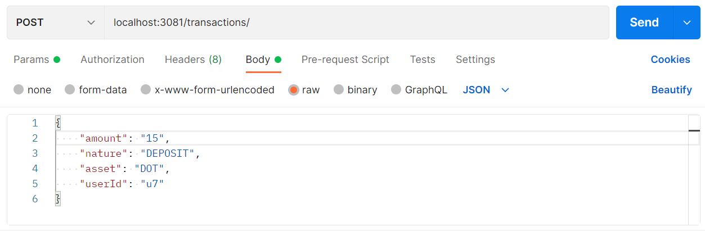

  <h1 align="center">Crypto Dashboard Backend</h1>

  <h3 align="center">
     Serve transactions data 
  </h3>

  
<h2 style="display: inline-block">Table of Contents</h2>

  <ol>
    <li>
      <a href="#about-the-project">About The Project</a>
      <ul>
        <li><a href="#built-with">Built With</a></li>
      </ul>
    </li>
    <li>
      <a href="#running-the-app">Running the app</a>
    </li>
    <li><a href="#testing">Testing</a></li>
    <li><a href="#license">License</a></li>
    <li><a href="#contact">Contact</a></li>
    <li><a href="#acknowledgements">Acknowledgements</a></li>
  </ol>

## About The Project 

Nest JS REST API to serve data about transactions and balances of a crypto dashboard. Users can create/view transactions and balances. Data is fetched from a fake database, a JSON file in the source folder of this project.
The endpoint is accessible at `http://localhost:3081/`. 

The available endpoints are: 
- `GET /transactions`
- `GET /balance/`
- `GET /balance/:id`
- `POST /transactions`

An example of a POST request in Postman is shown below. 

A front-end user interface has been developed and is accessible [here](https://github.com/srossella/crypto-dashboard-frontend).

### Built With

* [Setting up Postman](https://learning.postman.com/docs/getting-started/settings/)
* [Nest JS](https://nestjs.com/)

## Running the app

To run locally, `npm install`, then `nest start`

Once the app is running locally, you can access the API at `http://localhost:3081`. Endpoints are: 
 
- `GET /transactions`
- `GET /balance/`
- `GET /balance/:id`
- `POST /transactions`

## Testing
You can use various HTTP clients such as [Postman](https://www.postman.com/) to make requests to the API endpoints.

## License

Distributed under the MIT License. 

## Contact

Rossella Salaro - rossella.salaro@gmail.com

## Acknowledgements

* [Start2impact](http://start2impact.com/)